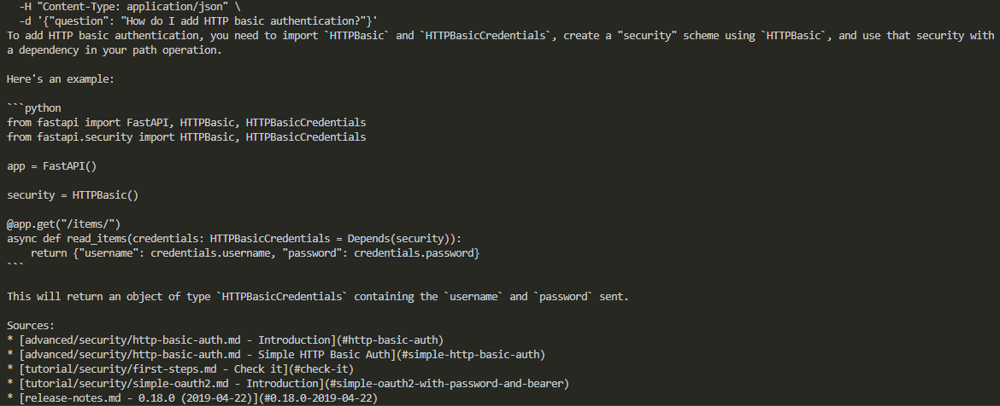
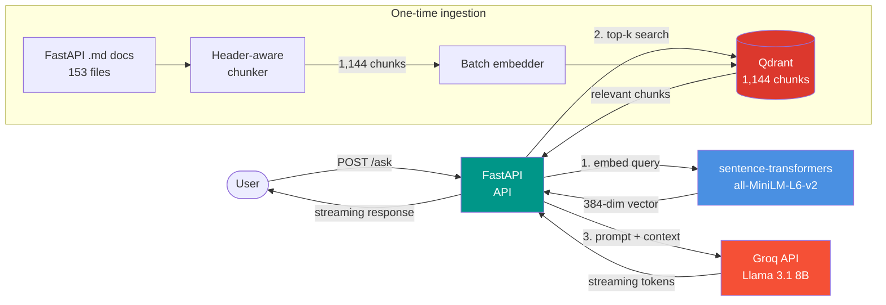

# 🔎 FastAPI Docs RAG

> A production-style RAG service that answers questions about FastAPI using its own documentation as the knowledge base.

[](https://www.python.org)
[](https://fastapi.tiangolo.com)
[](https://qdrant.tech)
[](https://groq.com)

Ask FastAPI questions in plain English, get grounded answers with source citations from the official docs.

## ✨ Demo



A typical streaming response for `"How do I add HTTP basic authentication?"` — the answer is generated token by token, and ends with a list of source files.

## 📖 What this is

**FastAPI Docs RAG** is a Retrieval-Augmented Generation service that lets you ask natural-language questions about FastAPI and get answers grounded in the official documentation.

Instead of hallucinating from memory like a raw LLM, the service:

1. **Retrieves** the most relevant chunks from a vector index of the FastAPI docs.
2. **Builds a prompt** with those chunks as context.
3. **Generates** an answer that cites which doc pages were used.

The project is built as a portfolio piece to demonstrate end-to-end backend + ML engineering skills: chunking strategy, embeddings, vector search, LLM orchestration, streaming HTTP responses, containerization, and graceful failure handling.

## 🎯 Features

- **Header-aware chunking** of markdown docs with paragraph-level overlap.
- **Semantic search** over 1,144 chunks via `sentence-transformers` and Qdrant.
- **Grounded answers** via Groq's hosted Llama 3.1 8B with low temperature and a strict system prompt.
- **Streaming responses** (`POST /ask/stream`) — answers appear token by token, just like ChatGPT.
- **Health endpoint** that pings Qdrant — returns `degraded` if the vector DB is unreachable.
- **Configurable via env** — model name, top-k, Qdrant host/port, log level.
- **Containerized with Docker Compose** (Qdrant + API + one-shot ingest service).

## 🏗️ Architecture



The flow:

1. **Ingestion** (one-time): markdown files are parsed, cleaned of HTML noise, and split by H2 headers. Long sections are further split into paragraphs with token-based overlap. Each chunk is embedded with `all-MiniLM-L6-v2` (384 dims) and upserted into Qdrant with metadata (source file, title, section).

2. **Query**: the user's question is embedded with the same model, top-K (default 5) similar chunks are retrieved by dot product, and a strict system prompt instructs Llama 3.1 8B to answer **only from the provided context** and cite sources.

3. **Streaming**: the LLM response is streamed token-by-token back to the client via FastAPI's `StreamingResponse`. The pipeline is loaded once at app startup via FastAPI's `lifespan` context manager, so embedder weights and the Qdrant client are reused across requests.

## 🛠️ Tech stack

| Layer | Choice | Why |
|-------|--------|-----|
| API framework | [FastAPI](https://fastapi.tiangolo.com) | Async, type-safe, auto-generated OpenAPI docs |
| Vector store | [Qdrant](https://qdrant.tech) | Simple to self-host, fast HNSW, good Python client |
| Embeddings | `all-MiniLM-L6-v2` | 90 MB, 384 dims, fast on CPU, good baseline |
| LLM | Groq-hosted Llama 3.1 8B | Free tier, low latency, OpenAI-compatible API |
| Settings | `pydantic-settings` | Type-safe env config with validation |
| Package manager | [uv](https://docs.astral.sh/uv) | 10–100× faster than pip, modern lockfile |
| Container | Docker + Compose | Standard, reproducible local stack |

## 🚀 Quick start

### Prerequisites

- Python 3.13 (managed automatically by [uv](https://docs.astral.sh/uv))
- Docker + Docker Compose
- A free [Groq API key](https://console.groq.com)

### Setup

```bash
# 1. Clone and enter the project
git clone https://github.com/notasandy/fastapi-docs-rag.git
cd fastapi-docs-rag

# 2. Install dependencies
uv sync

# 3. Set up environment
cp .env.example .env
# Edit .env and put your GROQ_API_KEY

# 4. Start Qdrant
docker compose up -d qdrant

# 5. Fetch and index FastAPI docs (one-time, ~3 min)
git clone --depth=1 https://github.com/fastapi/fastapi.git /tmp/fastapi
mkdir -p data/raw && cp -r /tmp/fastapi/docs/en/docs/* data/raw/
uv run python -m scripts.ingest

# 6. Run the API
uv run uvicorn src.api.main:app --reload
```

Open http://localhost:8000/docs to play with the interactive Swagger UI.

### Try it

```bash
curl -N -X POST http://localhost:8000/ask/stream \
  -H "Content-Type: application/json" \
  -d '{"question": "How do I add HTTP basic authentication?"}'
```

## 🔌 API reference

### `GET /health`

Liveness check. Returns `200` always; status field indicates Qdrant reachability.

```bash
curl http://localhost:8000/health
```

```json
{
  "status": "ok",
  "app": "FastAPI Docs RAG",
  "qdrant": "ok"
}
```

If Qdrant is down, you'll see `"status": "degraded"`, `"qdrant": "unreachable"`.

### `POST /ask`

Full non-streaming response.

```bash
curl -X POST http://localhost:8000/ask \
  -H "Content-Type: application/json" \
  -d '{"question": "How do I add CORS middleware?", "top_k": 5}'
```

Returns:

```json
{
  "answer": "...",
  "sources": [
    {
      "source_file": "tutorial/cors.md",
      "title": "CORS (Cross-Origin Resource Sharing)",
      "section": "Use CORSMiddleware",
      "score": 0.81
    }
  ]
}
```

### `POST /ask/stream`

Same as `/ask`, but streams the answer token-by-token. Use the `-N` flag with `curl` to disable buffering.

```bash
curl -N -X POST http://localhost:8000/ask/stream \
  -H "Content-Type: application/json" \
  -d '{"question": "..."}'
```

Response: `text/plain` stream, no trailing JSON.

## 📄 License

MIT — see [LICENSE](LICENSE).

## 👤 Author

Made by Sandy ([notasandy](https://github.com/notasandy)) — AI / LLM engineer, open to remote work. Reach me at notasandy@proton.me.
